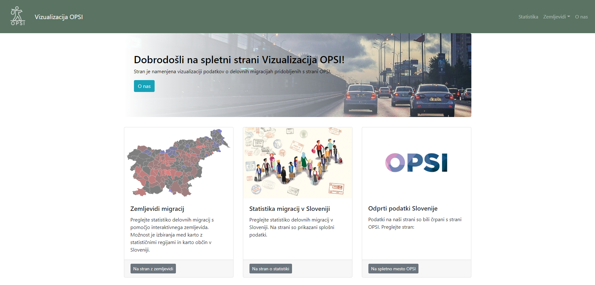
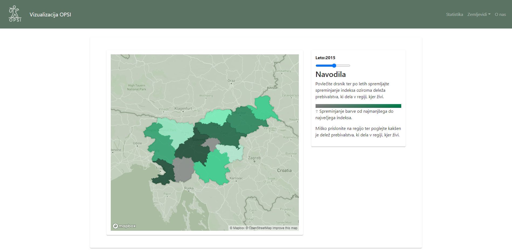
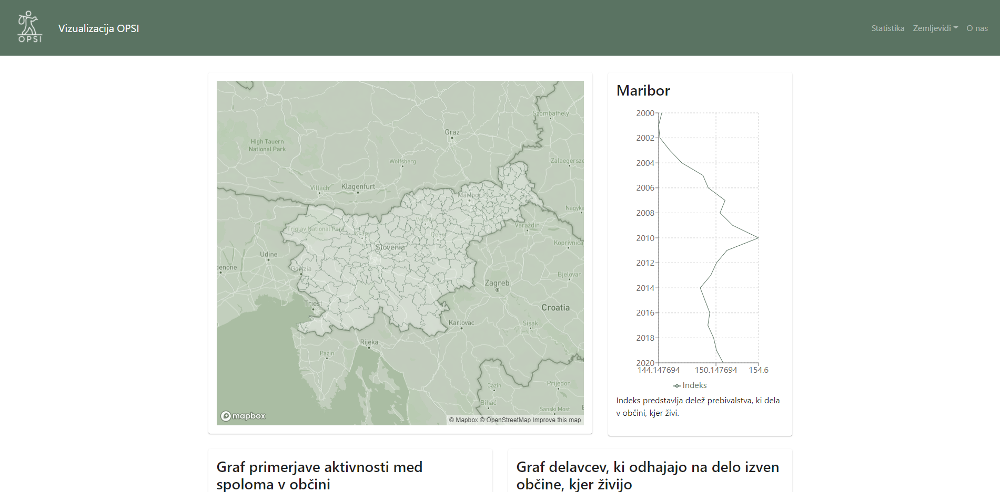

# Vizualizacija "OPSI" podatkov

## Opis projekta
    
Projekt je namenjen vizualizaciji podatkov o delovnih migracij v Sloveniji pridobljenih iz [Odprtih podaktkov Slovenije](https://podatki.gov.si/)

Projekt nastaja v sklopu predmeta _Praktikum II_ na Fakulteti za elektrotehiko, računalništvo in informatiko FERI.

## Tehnologije

- Front-end: React JS
  - [react-map-gl](https://visgl.github.io/react-map-gl/)
  - [mapbox-gl](https://www.mapbox.com/mapbox-gljs)
  - [recharts](https://recharts.org/en-US/)
- Upravljanje s podatki: Python

## Funkcionalnosti

- Pregled spreminjanja indeksa delovnih migracij regij med leti 2009 in 2020 s pomočjo interaktivnega zemljevida 

- Pregled grafov indeksa migracij in števila delovnih migrantov, glede na regijo/občino

- Pregled grafov indeksa migracij, primerjave aktivnosti med spoloma in grafov delavcev, ki delajo izven regije, kjer živijo, za posamzeno regijo s pomočjo interaktivnega zemljevida

- Pregled grafov indeksa migracij, primerjave aktivnosti med spoloma in grafov delavcev, ki delajo izven regije, kjer živijo, za posamzeno občino s pomočjo interaktivnega zemljevida

## Zaslonski posnetki

Homepage

----

Stran s statistiko

----

Stran z regijami

----

[Stran z občinami

## Namestitev

## Avtorji:
- Nik Kovačević
- Aljaž Neuberg
- Luka Ogrizek
- Timotej Vošinek

